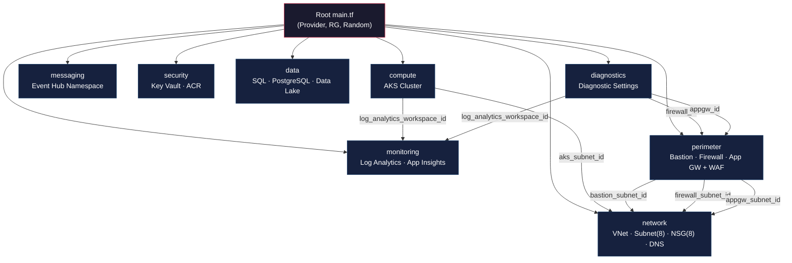

```mermaid
%%{init: {'theme': 'default', 'flowchart': {'useMaxWidth': true}}}%%
flowchart TB
    %% ==========================================
    %% 1. Public Zone (Internet)
    %% ==========================================
    subgraph PublicZone["Public Internet Zone"]
        Client["User Client"]
        Admin["Admin / Ops"]
    end

    %% ==========================================
    %% 2. Azure Cloud Environment
    %% ==========================================
    subgraph AzureCloud["Azure Cloud - Single VNet"]
        direction TB

        %% ------------------------------------------
        %% 2.1 Perimeter Subnet (Ingress Control)
        %% ------------------------------------------
        subgraph PerimeterSubnet["Subnet: Perimeter"]
            AppGW["App Gateway + WAF"]
        end

        %% ------------------------------------------
        %% 2.2 Application Subnet (AKS)
        %% ------------------------------------------
        subgraph AppSubnet["Subnet: App - AKS"]
            direction TB
            
            subgraph JavaApps["Java - Spring Boot"]
                AccSvc["Account Svc"]
                ComSvc["Commerce Svc"]
            end
            
            subgraph PythonApps["Python - FastAPI"]
                CrySvc["Crypto Svc"]
            end
        end

        %% ------------------------------------------
        %% 2.3 Messaging Subnet (Event Streaming)
        %% ------------------------------------------
        subgraph MsgSubnet["Subnet: Messaging"]
            EventHubs["Event Hubs (Kafka)"]
        end

        %% ------------------------------------------
        %% 2.4 Data Subnet (Private Database)
        %% ------------------------------------------
        subgraph DataSubnet["Subnet: Data"]
            SqlDB["SQL Database"]
            PostgreDB["PostgreSQL"]
            ConfLedger["Confidential Ledger"]
        end

        %% ------------------------------------------
        %% 2.5 Security & Management Subnet
        %% ------------------------------------------
        subgraph SecSubnet["Subnet: Security"]
            KeyVault["Key Vault"]
            ContainerRegistry["Container Registry"]
            PrivateDNS["Private DNS Zone"]
        end

        %% ------------------------------------------
        %% 2.6 Analytics Subnet (Control & Analytics)
        %% ------------------------------------------
        subgraph AnalyticsSubnet["Subnet: Analytics"]
            Databricks["Databricks"]
            DataLake["ADLS Gen2"]
        end

        %% ------------------------------------------
        %% 2.7 Egress & Ops Subnet
        %% ------------------------------------------
        subgraph EgressSubnet["Subnet: Egress"]
            AzFirewall["Firewall"]
        end

        subgraph OpsSubnet["Subnet: Ops"]
            Bastion["Bastion"]
        end
    end

    %% ==========================================
    %% 3. PaaS Observability (No Subnet)
    %% ==========================================
    subgraph MonitorLayer["Monitoring - PaaS"]
        LogAnalytics["Log Analytics"]
        AppInsights["App Insights"]
    end

    ExternalAPI["External API"]

    %% ==========================================
    %% Traffic Flows & Connections
    %% ==========================================

    %% 1. Ingress Flow
    Client -->|HTTPS| AppGW
    AppGW -->|Account| AccSvc
    AppGW -->|Commerce| ComSvc
    AppGW -->|Crypto| CrySvc

    %% 2. Admin Access
    Admin -->|SSH| Bastion
    Bastion -->|Access| AccSvc
    Bastion -->|Access| ComSvc

    %% 3. Application to Database (Private)
    AccSvc -->|Private EP| SqlDB
    ComSvc -->|Private EP| SqlDB
    CrySvc -->|REST API| ConfLedger
    
    %% 4. Messaging (Pub/Sub)
    AccSvc -.->|Publish| EventHubs
    ComSvc -.->|Publish| EventHubs
    CrySvc -.->|Publish| EventHubs
    EventHubs -.->|Subscribe| AccSvc
    EventHubs -.->|Subscribe| ComSvc
    EventHubs -.->|Subscribe| CrySvc

    %% 5. Analytics Flow
    EventHubs -->|Streaming| Databricks
    SqlDB -->|CDC| DataLake
    Databricks <-->|R/W| DataLake
    
    %% 6. Security & Dependencies
    AccSvc -->|Pull| ContainerRegistry
    ComSvc -->|Pull| ContainerRegistry
    CrySvc -->|Pull| ContainerRegistry
    AccSvc -->|Secrets| KeyVault
    ComSvc -->|Secrets| KeyVault
    CrySvc -->|Secrets| KeyVault
    Databricks -->|Secrets| KeyVault
    
    %% 7. Egress (Outbound)
    AccSvc -->|Outbound| AzFirewall
    ComSvc -->|Outbound| AzFirewall
    CrySvc -->|Outbound| AzFirewall
    AzFirewall -->|Filtered| ExternalAPI

    %% 8. Monitoring
    AccSvc -.->|Logs| LogAnalytics
    ComSvc -.->|Logs| LogAnalytics
    CrySvc -.->|Logs| LogAnalytics
    AppGW -.->|WAF Logs| LogAnalytics
    AzFirewall -.->|Net Logs| LogAnalytics
    Databricks -.->|Job Logs| LogAnalytics

    %% ==========================================
    %% Styles Legend (5-Level):
    %% 🔵 Blue (#e3f2fd, #1565c0) = Terraform 구성 완료
    %% 🟢 Green (#e8f5e9, #2e7d32) = 보안 강화 완료
    %% 🟠 Orange (#fff3e0, #e65100) = Terraform 범위 밖 (외부 요소)
    %% ⬛ Gray (#f5f5f5, #424242) = 미구현
    %% 🔴 Red (#ffebee, #c62828) = 오류 발생
    %% ==========================================
    
    %% Subnets - Configured (Blue) / Security Hardened (Green)
    style PerimeterSubnet fill:#e8f5e9,stroke:#2e7d32,stroke-width:2px
    style AppSubnet fill:#e8f5e9,stroke:#2e7d32,stroke-width:2px
    style DataSubnet fill:#e8f5e9,stroke:#2e7d32,stroke-width:2px
    style MsgSubnet fill:#e3f2fd,stroke:#1565c0,stroke-width:2px
    style SecSubnet fill:#e8f5e9,stroke:#2e7d32,stroke-width:2px
    style AnalyticsSubnet fill:#e8f5e9,stroke:#2e7d32,stroke-width:2px
    style EgressSubnet fill:#e8f5e9,stroke:#2e7d32,stroke-width:2px
    style OpsSubnet fill:#e3f2fd,stroke:#1565c0,stroke-width:2px
    style MonitorLayer fill:#e3f2fd,stroke:#1565c0,stroke-width:2px
    
    %% Security Hardened Resources (Green)
    style KeyVault fill:#e8f5e9,stroke:#2e7d32,stroke-width:2px
    style DataLake fill:#e8f5e9,stroke:#2e7d32,stroke-width:2px
    style SqlDB fill:#e8f5e9,stroke:#2e7d32,stroke-width:2px
    style AzFirewall fill:#e8f5e9,stroke:#2e7d32,stroke-width:2px
    style AppGW fill:#e8f5e9,stroke:#2e7d32,stroke-width:2px
    
    %% Not configured in Terraform (Gray)
    style JavaApps fill:#f5f5f5,stroke:#424242,stroke-width:2px
    style PythonApps fill:#f5f5f5,stroke:#424242,stroke-width:2px
    style AccSvc fill:#f5f5f5,stroke:#424242,stroke-width:1px
    style ComSvc fill:#f5f5f5,stroke:#424242,stroke-width:1px
    style CrySvc fill:#f5f5f5,stroke:#424242,stroke-width:1px
    
    %% Terraform 구성 완료 (Blue)
    style ConfLedger fill:#e3f2fd,stroke:#1565c0,stroke-width:2px
    style PostgreDB fill:#e3f2fd,stroke:#1565c0,stroke-width:2px
    style EventHubs fill:#e3f2fd,stroke:#1565c0,stroke-width:2px
    style ContainerRegistry fill:#e3f2fd,stroke:#1565c0,stroke-width:2px
    style Databricks fill:#e3f2fd,stroke:#1565c0,stroke-width:2px
    style Bastion fill:#e3f2fd,stroke:#1565c0,stroke-width:2px
    style LogAnalytics fill:#e3f2fd,stroke:#1565c0,stroke-width:2px
    style AppInsights fill:#e3f2fd,stroke:#1565c0,stroke-width:2px
    style PrivateDNS fill:#e3f2fd,stroke:#1565c0,stroke-width:2px
    
    %% Terraform 범위 밖 (Orange)
    style Client fill:#fff3e0,stroke:#e65100,stroke-width:2px
    style Admin fill:#fff3e0,stroke:#e65100,stroke-width:2px
    style ExternalAPI fill:#fff3e0,stroke:#e65100,stroke-width:2px
```

# Enterprise Platform - Terraform Infrastructure

Azure 기반 엔터프라이즈 플랫폼 인프라를 Terraform으로 정의한 IaC(Infrastructure as Code) 프로젝트입니다.
모든 리소스는 **모듈화** 되어 있으며, **Checkov 보안 하드닝**이 적용되어 있습니다.
---


---

## 📁 Directory Structure

```
INFRATEST/
├── main.tf                          # Root: Provider, Resource Group, Module 호출
├── outputs.tf                       # Root 출력값 (RG, AKS, VNet)
├── .terraform.lock.hcl              # Provider 버전 잠금 파일
│
├── modules/                         # ── Terraform 모듈 ──
│   ├── network/                     # VNet, Subnet(8), NSG(8), DNS Zone
│   │   ├── main.tf
│   │   ├── variables.tf
│   │   └── outputs.tf
│   ├── compute/                     # AKS Cluster
│   │   ├── main.tf
│   │   ├── variables.tf
│   │   └── outputs.tf
│   ├── messaging/                   # Event Hub Namespace
│   │   ├── main.tf
│   │   ├── variables.tf
│   │   └── outputs.tf
│   ├── security/                    # Key Vault, Container Registry
│   │   ├── main.tf
│   │   ├── variables.tf
│   │   └── outputs.tf
│   ├── data/                        # SQL Server + Audit, PostgreSQL, Data Lake
│   │   ├── main.tf
│   │   ├── variables.tf
│   │   └── outputs.tf
│   ├── monitoring/                  # Log Analytics, Application Insights
│   │   ├── main.tf
│   │   ├── variables.tf
│   │   └── outputs.tf
│   ├── perimeter/                   # Bastion, Firewall, App Gateway + WAF
│   │   ├── main.tf
│   │   ├── variables.tf
│   │   └── outputs.tf
│   └── diagnostics/                 # Firewall & AppGW Diagnostic Settings
│       ├── main.tf
│       └── variables.tf
│
├── reference/                       # ── 참조 문서 ──
│   ├── ExampleArch.md               # 아키텍처 예시
│   ├── TERRAFROM_TODO.md            # 작업 목록
│   ├── TEST_LOG.md                  # Checkov 테스트 로그
│   └── terraformtest.md             # 테라폼 테스트 기록
│
├── analyze_checkov.py               # Checkov 결과 분석 스크립트
├── checkov_result.txt               # Checkov 검사 결과 (요약)
└── checkov_full_result.txt          # Checkov 검사 결과 (전체)
```

---

## 🔗 Module Dependency Graph



---

## 🏗️ Module Summary

| Module | Resources | Description |
|:-------|:----------|:------------|
| **network** | VNet, Subnet ×8, NSG ×8, Private DNS Zone | 네트워크 기반 인프라 (10.0.0.0/16) |
| **compute** | AKS Cluster | Kubernetes 클러스터 (Calico 네트워크 정책) |
| **messaging** | Event Hub Namespace | 실시간 이벤트 스트리밍 |
| **security** | Key Vault, Container Registry | 비밀 관리 및 컨테이너 이미지 저장소 |
| **data** | SQL Server + Audit, PostgreSQL, Storage (ADLS Gen2) | 데이터 레이어 (감사 정책 포함) |
| **monitoring** | Log Analytics Workspace, Application Insights | 모니터링 및 로그 수집 |
| **perimeter** | Bastion Host, Azure Firewall, App Gateway + WAF (OWASP 3.2) | 경계 보안 (외부 접근 제어) |
| **diagnostics** | Firewall Diag, AppGW Diag | 진단 로그 → Log Analytics 전송 |

---

## 🔒 Security Hardening (Checkov)

다음 보안 설정이 적용되어 있습니다:

- **Key Vault**: Purge Protection, Soft Delete 90일, RBAC 인증, Network ACL Deny
- **Storage Account (ADLS)**: TLS 1.2, HTTPS Only, Public Access 차단, Shared Key 비활성화
- **SQL Server**: TLS 1.2, Public Network Access 차단, Extended Auditing
- **AKS**: Azure CNI + Calico, Azure Policy, OMS Agent 연동
- **App Gateway**: WAF v2 Prevention 모드, OWASP 3.2

---

## 🚀 Quick Start

```bash
# 1. 초기화
terraform init

# 2. 유효성 검사
terraform validate

# 3. 실행 계획 확인
terraform plan

# 4. 인프라 배포(배포금지배포금지배포금지배포금지배포금지배포금지배포금지배포금지배포금지)
terraform apply
```

---

## 📋 Requirements

| Tool | Version |
|:-----|:--------|
| Terraform | >= 1.0.0 |
| AzureRM Provider | ~> 3.0 |
| Random Provider | ~> 3.0 |
