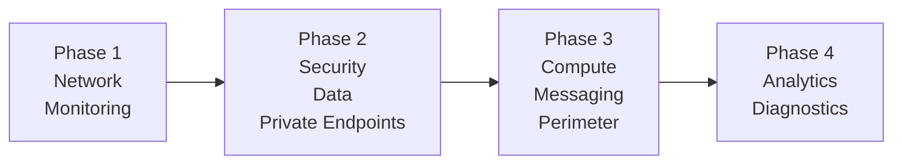

# NSC Infrastructure Architecture & Modules Guide

이 문서는 `infra_terraform_v02` 프로젝트의 인프라 구축 단계(Phases), 세부 디렉토리 구조 및 시크릿(비밀 변수) 관리 가이드를 설명합니다. 안전하고 모듈화된 인프라 배포를 위해 역할별로 논리적인 파일과 디렉토리 분리를 하였습니다.

---

## 📍 인프라 프로비저닝 단계 (Phases)

클라우드 인프라는 순환 참조와 의존성 문제를 방지하기 위해 4개의 단계(Phase)를 거쳐 배포되도록 설계되었습니다.



| Phase | 담당 모듈 | 주요 배포 리소스 |
|:---|:---|:---|
| **Phase 1** | `network`, `routing`, `monitoring` | VNet, Subnets (10개), NSG (6개), UDR (3개), Log Analytics, App Insights |
| **Phase 2** | `security`, `data`, `private_endpoints` | Key Vault, ACR, DNS Zones (7개), SQL DB, PostgreSQL, Ledger, PE (7개) |
| **Phase 3** | `compute`, `messaging`, `perimeter` | AKS, Event Hubs, AppGW, WAF, Bastion, Firewall, PIP (3개) |
| **Phase 4** | `analytics`, `diagnostics` | Databricks, ADLS Gen2, Diagnostic Settings (5개) |

### 💡 빌드 순서 지정 근거
1. **network 먼저 배포**: 모든 상위 리소스가 서브넷(Subnet) 의존성을 가짐
2. **monitoring 먼저 배포**: 각종 모니터링 에이전트와 Diagnostic Settings가 Log Analytics Workspace ID를 필요로 함
3. **security / data → private_endpoints 배포**: Private Endpoint 생성을 위해서는 대상 리소스 ID, 서브넷 ID, 개인 DNS Zone ID가 동시에 필요함
4. **compute / perimeter 배포**: AKS 생성 시 ACR/KV의 RBAC 권한(Role Assignment)이 필요하며, Firewall의 경우 UDR nextHop IP 역전달 과정이 필요함
5. **analytics / diagnostics 마지막 배포**: Databricks (VNet Injection용 서브넷/NSG 필요), Diagnostics (앞서 생성된 모든 리소스의 ID를 대상으로 등록해야 함)

---

## 🗂️ 핵심 디렉토리 및 파일 구조

```text
infra_terraform_v02/
│
├── 📁 .terraform/                # 🔴 [유지] 자동 생성되는 TF 관련 바이너리 (절대 건드리지 않음)
│
├── 📁 docs/                      # 💡 [문서] 문서 자산 보관 (Terraform 실행에 영향 없음)
│   ├── Manual.md                 # 프로젝트 아키텍처 상세 가이드
│   ├── README_implementPlan.md   # 구현 계획서 (초안)
│   └── azure_resources.json      # 기존 인프라 배포 정보용 (메타데이터 JSON)
│
├── 📁 logs/                      # 💡 [로그] 스캔 기록 보관
│   ├── checkov_result.txt        # IaC 보안 취약점 스캔(Checkov) 결과
│   ├── acr_check.txt             # 배포 정상화 검사 - ACR
│   ├── aks_check.txt             # 배포 정상화 검사 - AKS
│   └── orange_check.txt          # 배포 정상화 검사 - Orange(내부 점검 등)
│
├── 📁 tests/                     # 💡 [테스트] 배포 테스트 및 검증 결과 보관
│   ├── Deploy_TEST_LOG.md        # 전체 배포/파괴 런타임 결과 로그
│   └── Validation_TEST_LOG.md    # 생성된 리소스 상세 검증 로그
│
├── 📁 tfplans/                   # 💡 [계획] 일회성 배포 계획(Plan) 파일 임시 저장소
│   ├── tfplan                    # 바이너리 배포 계획 내용 (git ignore 대상)
│   ├── tfplan.json               # JSON 형태 배포 계획
│   └── tfplan_parallel           # 병렬 배포 플랜 점검용
│
├── 📁 modules/                   # 🟢 [핵심] 핵심 인프라 구현 모듈들
│   ├── network/                  # Phase 1: VNet, 10 subnets, 19 NSG Rules
│   ├── routing/                  # Phase 1: UDR(User Defined Route) 순환 참조 방지
│   ├── monitoring/               # Phase 1: LAW, App Insights
│   ├── security/                 # Phase 2: KV(RBAC), ACR(Premium), 7 DNS Zones
│   ├── data/                     # Phase 2: SQL Server/DB, PostgreSQL, Ledger
│   ├── private_endpoints/        # Phase 2: 7 Private Endpoints 연결 구성
│   ├── compute/                  # Phase 3: AKS (Workload Identity, CNI)
│   ├── messaging/                # Phase 3: Event Hubs Namespace, Topics
│   ├── perimeter/                # Phase 3: AppGW, WAF_v2, Bastion, Firewall
│   ├── analytics/                # Phase 4: Databricks (VNet Injection), ADLS
│   └── diagnostics/              # Phase 4: 리소스 Diagnostic Settings 자동화
│
├── main.tf                       # 🔴 [유지] Provider/RG 선언, 모듈 호출, 통합 RBAC 설정
├── variables.tf                  # 🔴 [유지] 전역 변수(Region, Prefix, CIDR 등)
├── outputs.tf                    # 🔴 [유지] 리소스별 주요 ID / IP 출력 포맷 지정
├── terraform.tfvars              # 🔴 [유지] 공통 프로젝트 환경 변수 세팅 
├── secrets.auto.tfvars           # 🔴 [유지] 민감한 비밀 변수 세팅 
├── secrets.auto.tfvars.example   # 🔴 [유지] 팀원 간 공유를 위한 빈 비밀 변수 템플릿
├── .terraform.lock.hcl           # 🔴 [유지] 로컬 Provider 버전 잠금 파일
├── .gitignore                    # 🔴 [유지] 깃허브 업로드 제외(Secret, State 등) 규칙
├── terraform.tfstate             # 🔴 [유지] [가장 중요] Azure 배포 실시간 상태 매핑 파일 
└── terraform.tfstate.backup      # 🔴 [유지] [가장 중요] 이전 배포 상태 백업 
```

### 아이콘 의미 안내
> - 🔴 **[유지]**: 위치를 이동하거나 삭제하면 Terraform 인프라 배포에 치명적인 문제가 발생합니다.
> - 🟢 **[핵심]**: 재사용 가능하게 논리적으로 분해한 Terraform 모듈 원본 코드들입니다.
> - 💡 **[문서/로그]**: 가독성을 위해 생성한 폴더로, 이 폴더 안의 파일들은 Terraform 실행과 전혀 무관하여 자유롭게 관리/수정할 수 있습니다.

---

## 🔐 시크릿 및 권한 안전 관리 가이드

> 전체 상세 문서가 필요한 경우 다음 문서를 참고하세요: [SECRETS_GUIDE.md](./SECRETS_GUIDE.md)

| 파일명 | GitHub 푸시 권장 | 주요 포함 내용 |
|:-----|:-------:|:-----|
| `terraform.tfvars` | ✅ 푸시 권장 | 배포 Region, 서버 Prefix, IP 대역대 등 **비보안 정보** |
| `secrets.auto.tfvars.example` | ✅ 푸시 권장 | 개발 환경 구성을 위한 **빈 비밀번호 템플릿** |
| `secrets.auto.tfvars` | ❌ **절대 금지** | 데이터베이스 관리자 패스워드 등 **치명적인 민감 정보** |

### 👨‍💻 신규 프론트/백엔드 개발자 로컬 환경 설정
1. 원격 저장소를 `Clone` 받습니다.
2. 터미널에서 다음 명령어를 통해 설정 템플릿을 복사합니다.
   ```bash
   # Unix/macOS/Linux
   cp secrets.auto.tfvars.example secrets.auto.tfvars
   
   # Windows (PowerShell)
   Copy-Item secrets.auto.tfvars.example secrets.auto.tfvars
   ```
3. 생성된 `secrets.auto.tfvars` 파일을 열고, 협업 메신저 등으로 전달받은 실제 비밀번호를 입력합니다. *(이 파일은 `.gitignore` 덕분에 자동으로 푸시에서 제외됩니다.)*
4. Terraform 명령을 실행하여 정상 동작을 확인합니다.
   ```bash
   terraform init
   terraform plan
   ```

### 🤖 CI/CD 파이프라인 (GitHub Actions) 구성법
원격 터미널에서 자동 배포될 때는 로컬의 자격 증명 파일을 쓸 수 없으므로, **GitHub Repository Secrets**에 변수값을 입력하고 환경 변수로 넘깁니다.
```yaml
env:
  TF_VAR_pg_admin_password: ${{ secrets.PG_ADMIN_PASSWORD }}
```

### 🎯 Passwordless (비밀번호 없는) 보안 현황
현재 설계된 `infra_terraform_v02`은 인프라 보안 최적화를 위해 **`pg_admin_password` (PostgreSQL)**를 제외한 나머지 서비스들의 비밀번호를 완전히 제거한 `Passwordless` 방식을 지향합니다.
* **Azure SQL Server**: `azuread_authentication_only = true` (Entra ID 전용 인증으로 비밀번호 삭제)
* **AKS, ACR, Key Vault**: 각 서비스끼리는 100% `Managed Identity (Entra ID 기반의 RBAC)` 방식을 통해 소통하여 Access Key나 Secret 유출 우려를 원천 봉쇄하였습니다.
