# Enterprise Platform - Terraform Infrastructure

Azure 기반 엔터프라이즈 플랫폼 인프라를 Terraform으로 정의한 IaC(Infrastructure as Code) 프로젝트입니다.
모든 리소스는 **모듈화** 되어 있으며, **Checkov 보안 하드닝**이 적용되어 있습니다.

---

## 📁 Directory Structure

```
INFRATEST/
├── main.tf                          # Root: Provider, Resource Group, Module 호출
├── outputs.tf                       # Root 출력값 (RG, AKS, VNet)
├── .terraform.lock.hcl              # Provider 버전 잠금 파일
│
├── modules/                         # ── Terraform 모듈 ──
│   ├── network/                     # VNet, Subnet(8), NSG(8), DNS Zone
│   │   ├── main.tf
│   │   ├── variables.tf
│   │   └── outputs.tf
│   ├── compute/                     # AKS Cluster
│   │   ├── main.tf
│   │   ├── variables.tf
│   │   └── outputs.tf
│   ├── messaging/                   # Event Hub Namespace
│   │   ├── main.tf
│   │   ├── variables.tf
│   │   └── outputs.tf
│   ├── security/                    # Key Vault, Container Registry
│   │   ├── main.tf
│   │   ├── variables.tf
│   │   └── outputs.tf
│   ├── data/                        # SQL Server + Audit, PostgreSQL, Data Lake
│   │   ├── main.tf
│   │   ├── variables.tf
│   │   └── outputs.tf
│   ├── monitoring/                  # Log Analytics, Application Insights
│   │   ├── main.tf
│   │   ├── variables.tf
│   │   └── outputs.tf
│   ├── perimeter/                   # Bastion, Firewall, App Gateway + WAF
│   │   ├── main.tf
│   │   ├── variables.tf
│   │   └── outputs.tf
│   └── diagnostics/                 # Firewall & AppGW Diagnostic Settings
│       ├── main.tf
│       └── variables.tf
│
├── reference/                       # ── 참조 문서 ──
│   ├── ExampleArch.md               # 아키텍처 예시
│   ├── TERRAFROM_TODO.md            # 작업 목록
│   ├── TEST_LOG.md                  # Checkov 테스트 로그
│   └── terraformtest.md             # 테라폼 테스트 기록
│
├── analyze_checkov.py               # Checkov 결과 분석 스크립트
├── checkov_result.txt               # Checkov 검사 결과 (요약)
└── checkov_full_result.txt          # Checkov 검사 결과 (전체)
```

---

## 🔗 Module Dependency Graph

```mermaid
graph TD
    Root["Root main.tf<br/>(Provider, RG, Random)"]

    Root --> monitoring["monitoring<br/>Log Analytics · App Insights"]
    Root --> network["network<br/>VNet · Subnet(8) · NSG(8) · DNS"]
    Root --> compute["compute<br/>AKS Cluster"]
    Root --> messaging["messaging<br/>Event Hub Namespace"]
    Root --> security["security<br/>Key Vault · ACR"]
    Root --> data["data<br/>SQL · PostgreSQL · Data Lake"]
    Root --> perimeter["perimeter<br/>Bastion · Firewall · App GW + WAF"]
    Root --> diagnostics["diagnostics<br/>Diagnostic Settings"]

    compute -->|aks_subnet_id| network
    compute -->|log_analytics_workspace_id| monitoring
    perimeter -->|bastion_subnet_id| network
    perimeter -->|firewall_subnet_id| network
    perimeter -->|appgw_subnet_id| network
    diagnostics -->|firewall_id| perimeter
    diagnostics -->|appgw_id| perimeter
    diagnostics -->|log_analytics_workspace_id| monitoring

    style Root fill:#1a1a2e,stroke:#e94560,color:#fff
    style network fill:#16213e,stroke:#0f3460,color:#fff
    style compute fill:#16213e,stroke:#0f3460,color:#fff
    style messaging fill:#16213e,stroke:#0f3460,color:#fff
    style security fill:#16213e,stroke:#0f3460,color:#fff
    style data fill:#16213e,stroke:#0f3460,color:#fff
    style monitoring fill:#16213e,stroke:#0f3460,color:#fff
    style perimeter fill:#16213e,stroke:#0f3460,color:#fff
    style diagnostics fill:#16213e,stroke:#0f3460,color:#fff
```



---

## 🏗️ Module Summary

| Module | Resources | Description |
|:-------|:----------|:------------|
| **network** | VNet, Subnet ×8, NSG ×8, Private DNS Zone | 네트워크 기반 인프라 (10.0.0.0/16) |
| **compute** | AKS Cluster | Kubernetes 클러스터 (Calico 네트워크 정책) |
| **messaging** | Event Hub Namespace | 실시간 이벤트 스트리밍 |
| **security** | Key Vault, Container Registry | 비밀 관리 및 컨테이너 이미지 저장소 |
| **data** | SQL Server + Audit, PostgreSQL, Storage (ADLS Gen2) | 데이터 레이어 (감사 정책 포함) |
| **monitoring** | Log Analytics Workspace, Application Insights | 모니터링 및 로그 수집 |
| **perimeter** | Bastion Host, Azure Firewall, App Gateway + WAF (OWASP 3.2) | 경계 보안 (외부 접근 제어) |
| **diagnostics** | Firewall Diag, AppGW Diag | 진단 로그 → Log Analytics 전송 |

---

## 🔒 Security Hardening (Checkov)

다음 보안 설정이 적용되어 있습니다:

- **Key Vault**: Purge Protection, Soft Delete 90일, RBAC 인증, Network ACL Deny
- **Storage Account (ADLS)**: TLS 1.2, HTTPS Only, Public Access 차단, Shared Key 비활성화
- **SQL Server**: TLS 1.2, Public Network Access 차단, Extended Auditing
- **AKS**: Azure CNI + Calico, Azure Policy, OMS Agent 연동
- **App Gateway**: WAF v2 Prevention 모드, OWASP 3.2

---

## 🚀 Quick Start

```bash
# 1. 초기화
terraform init

# 2. 유효성 검사
terraform validate

# 3. 실행 계획 확인
terraform plan

# 4. 인프라 배포(배포금지배포금지배포금지배포금지배포금지배포금지배포금지배포금지배포금지)
terraform apply
```

---

## 📋 Requirements

| Tool | Version |
|:-----|:--------|
| Terraform | >= 1.0.0 |
| AzureRM Provider | ~> 3.0 |
| Random Provider | ~> 3.0 |
