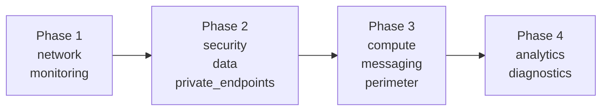

# Terraform Infrastructure Build — NSC Platform v02

## Source of Truth

- [README.md](./README.md) (Architecture Manual v02) — **유일한 기준 문서**

---

## 디렉토리 구조

```
infra_terraform_v02/
│
├── main.tf                          # Provider, RG, 전체 Module 호출, RBAC Role Assignments
├── variables.tf                     # 전역 변수 (location, naming, CIDR, pg_admin_password)
├── outputs.tf                       # Phase 1-4 주요 리소스 ID/IP/URL 출력
├── terraform.tfvars                 # 비민감 변수 값 (Git ✅)
├── secrets.auto.tfvars              # 민감 변수 값 (Git ❌ — .gitignore 등록)
├── secrets.auto.tfvars.example      # 민감 변수 빈 템플릿 (Git ✅ — 팀원 참조용)
├── .gitignore                       # secrets, .tfstate, .terraform 제외 규칙
│
├── modules/
│   ├── network/                     # Phase 1 — VNet + 10 Subnets + 6 NSGs + 3 UDRs
│   │   ├── main.tf                  #   VNet, 10 subnets, NSG 19개 규칙, UDR (FW 조건부)
│   │   ├── variables.tf             #   RG, CIDR, firewall_private_ip
│   │   └── outputs.tf               #   vnet_id, subnet_ids(맵), nsg_ids(맵)
│   │
│   ├── monitoring/                  # Phase 1 — Log Analytics + Application Insights
│   │   ├── main.tf                  #   LAW (PerGB2018, 30일), App Insights (workspace-based)
│   │   ├── variables.tf             #   RG, prefix, environment
│   │   └── outputs.tf               #   law_id, law_name, ai_id, ai_key
│   │
│   ├── security/                    # Phase 2 — Key Vault + ACR + 7 Private DNS Zones
│   │   ├── main.tf                  #   KV (RBAC, PE-only), ACR (Premium), 7 DNS Zones + 7 VNet Links
│   │   ├── variables.tf             #   tenant_id, suffix, vnet_id
│   │   └── outputs.tf               #   kv_id, kv_uri, acr_id, acr_login, dns_zone_ids(맵)
│   │
│   ├── data/                        # Phase 2 — SQL DB + PostgreSQL + Confidential Ledger
│   │   ├── main.tf                  #   SQL Server (AAD-only), SQL DB (GP vCore 2, 32GB), PG (B1ms), Ledger
│   │   ├── variables.tf             #   tenant_id, object_id, pg_admin_password(sensitive)
│   │   └── outputs.tf               #   sql_server_id/fqdn, pg_id/fqdn, sql_database_id, ledger_id
│   │
│   ├── private_endpoints/           # Phase 2 — 7개 PE (조건부 생성)
│   │   ├── main.tf                  #   SQL/PG/Ledger(Data), KV/ACR(Security), EH(Messaging), ADLS(Analytics)
│   │   ├── variables.tf             #   subnet_ids(맵), dns_zone_ids(맵), 각 resource_id(빈 문자열=미생성)
│   │   └── outputs.tf               #   pe_ids(맵, try() 사용)
│   │
│   ├── compute/                     # Phase 3 — AKS
│   │   ├── main.tf                  #   AKS (D4s_v3 × 3, AutoScale 3-10, Workload Identity, Azure CNI)
│   │   ├── variables.tf             #   aks_subnet_id, law_id
│   │   └── outputs.tf               #   aks_id, fqdn, mi_principal_id, kubelet_object_id
│   │
│   ├── messaging/                   # Phase 3 — Event Hubs
│   │   ├── main.tf                  #   Namespace (Standard, 2TU, AutoInflate 10), 2 Topics, 2 Consumer Groups
│   │   ├── variables.tf             #   RG, prefix, environment
│   │   └── outputs.tf               #   namespace_id, namespace_name
│   │
│   ├── perimeter/                   # Phase 3 — AppGW + WAF + Bastion + Firewall
│   │   ├── main.tf                  #   3 PIPs, WAF Policy (OWASP 3.2), AppGW (WAF_v2), Bastion, FW + 10 Rules
│   │   ├── variables.tf             #   subnet_ids, CIDRs (app, analytics, vnet)
│   │   └── outputs.tf               #   appgw_id, bastion_id, fw_id, fw_private_ip, fw_public_ip
│   │
│   ├── analytics/                   # Phase 4 — Databricks + ADLS Gen2
│   │   ├── main.tf                  #   2 NSGs + Associations, Databricks (VNet Injection), ADLS (HNS, TLS 1.2)
│   │   ├── variables.tf             #   vnet_id, subnet_ids/names (host, container), suffix
│   │   └── outputs.tf               #   dbw_id, dbw_url, adls_id, adls_name
│   │
│   └── diagnostics/                 # Phase 4 — Diagnostic Settings → LAW
│       ├── main.tf                  #   5 Diagnostic Settings (AKS, AppGW, FW, KV, SQL DB, 조건부)
│       └── variables.tf             #   law_id, 각 resource_id (빈 문자열=미생성)
│
├── README.md                        # Architecture Manual v02 (변경 없음)
├── README_implementPlan.md          # ← 이 파일
├── SECRETS_GUIDE.md                 # 시크릿 관리 가이드 (팀 공유)
└── LLMs_review.md                   # 리뷰 기록 (변경 없음)
```

---

## Phase 순서 및 의존관계



| Phase | 모듈 | 리소스 수 | 근거 (README 섹션) |
|:---|:---|:---|:---|
| 1 | `network`, `monitoring` | VNet + 10 Subnets + 6 NSGs + 3 UDRs + LAW + AI | §2.5, §4.1, §4.2, §7.1, §7.2 |
| 2 | `security`, `data`, `private_endpoints` | KV + ACR + 7 DNS + SQL + PG + Ledger + 7 PEs | §4.3, §5.2, §7.1, §7.3 |
| 3 | `compute`, `messaging`, `perimeter` | AKS + EH + AppGW + WAF + Bastion + FW + 3 PIPs | §5.3, §7.1 |
| 4 | `analytics`, `diagnostics` | Databricks + ADLS + 5 Diagnostic Settings | §6.6, §7.1 |

---

## 빌드 순서 이유

1. **network 먼저** — 모든 리소스가 서브넷 ID를 참조
2. **monitoring 먼저** — Diagnostic Settings와 OMS Agent가 LAW ID를 참조
3. **security/data → PE** — PE가 리소스 ID + 서브넷 ID + DNS Zone ID 셋 다 필요
4. **compute/perimeter** — AKS → ACR/KV Role Assignment, Firewall → UDR nextHop IP 역전달
5. **analytics/diagnostics 마지막** — Databricks → VNet Injection (서브넷 + NSG), Diagnostics → 모든 리소스 ID

---

## 🔐 시크릿 관리

> 상세 가이드: [SECRETS_GUIDE.md](./SECRETS_GUIDE.md)

### 파일 분류

| 파일 | GitHub | 내용 |
|:-----|:-------|:-----|
| `terraform.tfvars` | ✅ | location, prefix, subnet CIDRs (비민감) |
| `secrets.auto.tfvars` | ❌ | pg_admin_password 등 (민감) |
| `secrets.auto.tfvars.example` | ✅ | 빈 템플릿 (팀원 참조용) |

### 신규 팀원 로컬 설정

```powershell
Copy-Item secrets.auto.tfvars.example secrets.auto.tfvars   # 템플릿 복사
# secrets.auto.tfvars에 실제 비밀번호 입력
terraform init && terraform plan                            # 자동 로드
```

### CI/CD 환경 (GitHub Actions)

```yaml
env:
  TF_VAR_pg_admin_password: ${{ secrets.PG_ADMIN_PASSWORD }}
```

### 현재 민감 변수

| 변수명 | 용도 | 비고 |
|:-------|:-----|:-----|
| `pg_admin_password` | PostgreSQL 초기 관리자 | `sensitive = true`, AAD 전환 예정 |

> SQL Server는 `azuread_authentication_only = true` → 비밀번호 불필요  
> AKS, ACR, Key Vault → Managed Identity 기반 → 별도 키 불필요
