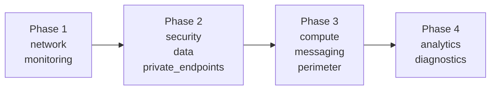

# Terraform Infrastructure Build — NSC Platform v02

## Source of Truth

- [README.md](file:///c:/Users/EL073/Downloads/Microsoft%20Academy%20Final%20Project%20Team%20Org/Infra/infra_terraform_v02/README.md) (Architecture Manual v02) — **유일한 기준 문서**

---

## 디렉토리 구조

```
infra_terraform_v02/
│
├── main.tf                      # Provider, RG, Module calls
├── variables.tf                 # 전역 변수 (location, naming, CIDR)
├── outputs.tf                   # 주요 리소스 ID/IP 출력
├── terraform.tfvars             # 변수 값
│
├── modules/
│   ├── network/                 # Phase 1 — VNet + 9 Subnets + NSG + UDR
│   │   ├── main.tf
│   │   ├── variables.tf
│   │   └── outputs.tf
│   │
│   ├── monitoring/              # Phase 1 — Log Analytics + App Insights
│   │   ├── main.tf
│   │   ├── variables.tf
│   │   └── outputs.tf
│   │
│   ├── security/                # Phase 2 — Key Vault + ACR + Private DNS Zones
│   │   ├── main.tf
│   │   ├── variables.tf
│   │   └── outputs.tf
│   │
│   ├── data/                    # Phase 2 — SQL DB + PostgreSQL + Confidential Ledger
│   │   ├── main.tf
│   │   ├── variables.tf
│   │   └── outputs.tf
│   │
│   ├── private_endpoints/       # Phase 2 — 7개 PE + DNS Zone Links
│   │   ├── main.tf
│   │   ├── variables.tf
│   │   └── outputs.tf
│   │
│   ├── compute/                 # Phase 3 — AKS (Node Pool + RBAC + Workload Identity)
│   │   ├── main.tf
│   │   ├── variables.tf
│   │   └── outputs.tf
│   │
│   ├── messaging/               # Phase 3 — Event Hubs (Kafka Protocol)
│   │   ├── main.tf
│   │   ├── variables.tf
│   │   └── outputs.tf
│   │
│   ├── perimeter/               # Phase 3 — AppGW + WAF + Bastion + Firewall
│   │   ├── main.tf
│   │   ├── variables.tf
│   │   └── outputs.tf
│   │
│   ├── analytics/               # Phase 4 — Databricks + ADLS Gen2
│   │   ├── main.tf
│   │   ├── variables.tf
│   │   └── outputs.tf
│   │
│   └── diagnostics/             # Phase 4 — Diagnostic Settings (→ LAW)
│       ├── main.tf
│       └── variables.tf
│
├── README.md                    # Architecture Manual v02 (변경 없음)
├── README_implementPlan.md      # ← 이 파일
└── LLMs_review.md               # 리뷰 기록 (변경 없음)
```

---

## Phase 순서 및 의존관계



| Phase | 모듈 | 근거 (README 섹션) |
|:---|:---|:---|
| 1 | `network`, `monitoring` | §2.5 Subnet Inventory, §7.2 Network Config, §7.1 Log Analytics |
| 2 | `security`, `data`, `private_endpoints` | §5.2 Secret Policy, §4.3 PE Mapping, §7.1 Resource Config |
| 3 | `compute`, `messaging`, `perimeter` | §7.1 AKS/EventHubs/AppGW, §5.3 WAF/Firewall Rules |
| 4 | `analytics`, `diagnostics` | §7.1 Databricks/ADLS, §6.6 Observability Flow |

---

## 빌드 순서 이유

1. **network 먼저** — 모든 리소스가 서브넷 ID를 참조
2. **monitoring 먼저** — Diagnostic Settings가 LAW ID를 참조
3. **security/data → PE** — PE가 리소스 ID + 서브넷 ID 둘 다 필요
4. **compute/perimeter 마지막** — AKS → ACR/KV Role Assignment, AppGW → Subnet ID
