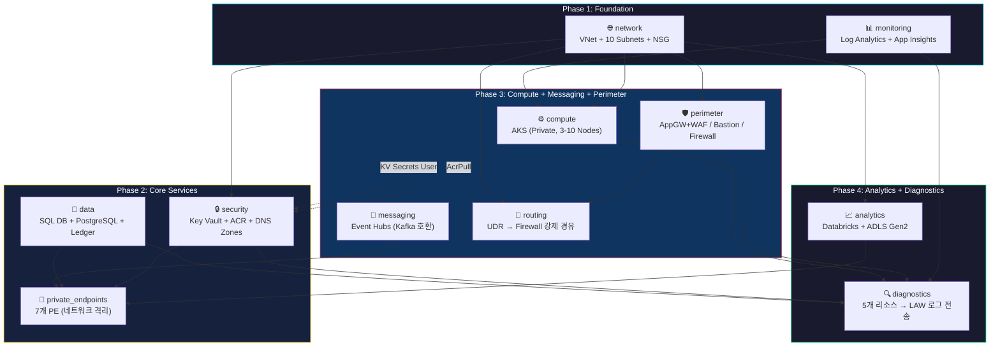

# NSC Platform — 인프라 아키텍처 치트시트

> **한 줄 요약**: 글로벌 스테이블코인 결제 플랫폼(NSC)의 Azure 인프라를 Terraform 11개 모듈로 구성하여, 네트워크 격리 → 보안 → 컴퓨팅 → 분석까지 4단계(Phase)로 배포한다.

---

## 1. 전체 구조 다이어그램



---

## 2. Phase별 모듈 역할표

### Phase 1: Foundation (기반 — 모든 것의 시작점)

| 모듈 | 뭘 만드나 | 리소스 수 | 핵심 역할 |
|------|----------|----------|----------|
| **network** | VNet 1개 + 서브넷 10개 + NSG 7개 + NSG Rule 20+개 | ~40 | 전체 네트워크의 "땅"을 깐다. 누가 누구와 통신할 수 있는지 여기서 결정. |
| **monitoring** | Log Analytics Workspace + Application Insights | 2 | 모든 리소스의 로그가 모이는 "중앙 관제실". |

### Phase 2: Core Services (핵심 서비스)

| 모듈 | 뭘 만드나 | 리소스 수 | 핵심 역할 |
|------|----------|----------|----------|
| **security** | Key Vault + ACR(Premium) + Private DNS Zone 7개 + VNet Link 7개 | ~16 | 비밀키 보관(KV) + 컨테이너 이미지 저장소(ACR) + 내부 DNS 체계. |
| **data** | SQL Server + SQL DB + PostgreSQL + Confidential Ledger | 4 | 거래 데이터(SQL), 암호화폐 데이터(PG), 변조방지 감사로그(Ledger). |
| **private_endpoints** | Private Endpoint 6개 (SQL, PG, KV, ACR, EventHubs, ADLS) | ~18 | 모든 데이터 서비스를 **인터넷에서 차단**하고 VNet 내부로만 접근 가능하게. |

### Phase 3: Compute + Messaging + Perimeter (실행 계층)

| 모듈 | 뭘 만드나 | 리소스 수 | 핵심 역할 |
|------|----------|----------|----------|
| **compute** | AKS Cluster (Private, D4s_v3 ×3, AutoScale 3-10) | 1 | 마이크로서비스(Spring Boot, FastAPI)가 실행되는 곳. |
| **messaging** | Event Hubs Namespace + 토픽 2개 + Consumer Group 2개 | 5 | `order-events`(주문), `cdc-events`(변경감지) — 서비스간 비동기 통신. |
| **perimeter** | AppGW(WAF_v2) + Bastion + Firewall + WAF Policy + FW Rules | ~10 | **입구**(AppGW), **관리접속**(Bastion), **출구**(Firewall) — 3방향 경비. |
| **routing** | Route Table 3개 + Route 3개 + Subnet Association 4개 | 10 | app/data/analytics 서브넷의 모든 외부 트래픽을 **Firewall 경유 강제**. |

### Phase 4: Analytics + Diagnostics (분석 및 관측)

| 모듈 | 뭘 만드나 | 리소스 수 | 핵심 역할 |
|------|----------|----------|----------|
| **analytics** | Databricks(Premium, VNet Injection) + ADLS Gen2 | ~6 | 데이터 분석 워크스페이스 + 데이터레이크 스토리지. |
| **diagnostics** | Diagnostic Setting 5개 (AKS, AppGW, FW, KV, SQL) | 5 | 핵심 리소스의 로그를 Log Analytics로 자동 전송. |

### + Root Level (main.tf)

| 리소스 | 역할 |
|--------|------|
| **RBAC: AKS → ACR Pull** | AKS가 ACR에서 컨테이너 이미지를 가져올 수 있게 권한 부여 |
| **RBAC: AKS → KV Secrets** | AKS가 Key Vault의 비밀키를 읽을 수 있게 권한 부여 |

---

## 3. 트래픽 흐름: 사용자 요청이 DB까지 가는 경로

```
사용자 (인터넷)
    │
    ▼ HTTPS 443
┌─────────────────────────┐
│  AppGW + WAF (Perimeter)│  ← OWASP 3.2 룰로 악성 요청 차단
│  nsc-agw-dev            │
└────────┬────────────────┘
         │ 8443 (End-to-End TLS)
         ▼
┌─────────────────────────┐
│  AKS Cluster (App)      │  ← Spring Boot / FastAPI 마이크로서비스
│  nsc-aks-dev (Private)  │
└────┬──────────┬─────────┘
     │          │
     │ 9093     │ 1433/5432
     ▼          ▼
┌─────────┐  ┌─────────────────┐
│ Event   │  │ SQL DB /        │  ← Private Endpoint 경유만 가능
│ Hubs    │  │ PostgreSQL      │     (인터넷 접근 차단됨)
│ (Kafka) │  │ (PE Only)       │
└─────────┘  └─────────────────┘

     ※ AKS ↔ 외부(인터넷) 통신은 모두 Firewall 경유 (UDR 강제)
     ※ 관리자 접속은 Bastion을 통해서만 가능 (SSH/RDP 직접 접근 차단)
```

---

## 4. 서브넷 맵: 누가 어디에 사는가

```
VNet: 10.0.0.0/16 (nsc-vnet-dev)
├─────────────────────────────────────────────────────────────────┐
│                                                                 │
│  ┌──────────────────────┐  ┌──────────────────────┐            │
│  │ 10.0.0.0/24          │  │ 10.0.1.0/26          │            │
│  │ perimeter            │  │ bastion              │            │
│  │ AppGW + WAF          │  │ AzureBastionSubnet   │            │
│  └──────────────────────┘  └──────────────────────┘            │
│                                                                 │
│  ┌──────────────────────────────────────────────┐              │
│  │ 10.0.2.0/23 (512 IPs)                        │              │
│  │ app — AKS Node Pool                          │              │
│  └──────────────────────────────────────────────┘              │
│                                                                 │
│  ┌──────────────────────┐  ┌──────────────────────┐            │
│  │ 10.0.4.0/24          │  │ 10.0.5.0/24          │            │
│  │ data                 │  │ security             │            │
│  │ SQL/PG/Ledger PE     │  │ KV/ACR PE            │            │
│  └──────────────────────┘  └──────────────────────┘            │
│                                                                 │
│  ┌──────────────────────┐  ┌──────────────────────┐            │
│  │ 10.0.6.0/24          │  │ 10.0.7.0/24          │            │
│  │ analytics_host       │  │ analytics_container  │            │
│  │ Databricks Public    │  │ Databricks Private   │            │
│  └──────────────────────┘  └──────────────────────┘            │
│                                                                 │
│  ┌──────────────────────┐  ┌──────────────────────┐            │
│  │ 10.0.8.0/26          │  │ 10.0.9.0/24          │            │
│  │ egress               │  │ messaging            │            │
│  │ AzureFirewallSubnet  │  │ Event Hubs PE        │            │
│  └──────────────────────┘  └──────────────────────┘            │
│                                                                 │
│  ┌──────────────────────┐                                      │
│  │ 10.0.10.0/28 (16IPs) │                                      │
│  │ admin                │                                      │
│  │ Admin UI (Backoffice)│                                      │
│  └──────────────────────┘                                      │
│                                                                 │
├─────────────────────────────────────────────────────────────────┘
```

---

## 5. 핵심 보안 원칙 요약

| 원칙 | 구현 방법 | 관련 모듈 |
|------|----------|----------|
| **Zero Trust 네트워크** | 모든 데이터 서비스 Public Access = false + Private Endpoint | private_endpoints |
| **최소 권한 (Least Privilege)** | RBAC + Managed Identity (비밀번호 없는 인증) | compute, security |
| **Egress 통제** | 모든 외부 트래픽 Firewall 경유 강제 (UDR) | routing, perimeter |
| **WAF 방어** | OWASP CRS 3.2, Prevention Mode | perimeter |
| **감사 추적** | Confidential Ledger (변조불가) + SQL Ledger 활성화 | data |
| **관측성 (Observability)** | 5개 핵심 리소스 → Log Analytics 자동 전송 | diagnostics, monitoring |

---

## 6. 빠른 참조: 모듈 파일 구조

```
infra_terraform_v02/
├── main.tf              ← 11개 모듈 호출 + RBAC 2개
├── variables.tf         ← 전역 변수 (CIDR, prefix, env, tags)
├── outputs.tf           ← 13개 출력값 (FQDN, ID 등)
├── terraform.tfvars     ← 실제 변수값
├── secrets.auto.tfvars  ← 비밀번호 (gitignore 대상)
│
└── modules/
    ├── network/         ← VNet, 10 Subnets, 7 NSGs, 20+ Rules
    ├── monitoring/      ← LAW, App Insights
    ├── security/        ← Key Vault, ACR, 7 DNS Zones, 7 VNet Links
    ├── data/            ← SQL Server+DB, PostgreSQL, Ledger
    ├── private_endpoints/← 6 PEs + DNS Zone Groups
    ├── compute/         ← AKS (Private, AutoScale)
    ├── messaging/       ← Event Hubs NS, 2 Topics, 2 Consumer Groups
    ├── perimeter/       ← AppGW+WAF, Bastion, Firewall, FW Rules
    ├── routing/         ← 3 Route Tables → Firewall 경유
    ├── analytics/       ← Databricks (VNet Injection), ADLS Gen2
    └── diagnostics/     ← 5 Diagnostic Settings → LAW
```

---

## 7. 배포 순서 (의존성 체인)

```
Phase 1 ─── network ──┬─── Phase 2 ─── security ──┬─── Phase 3 ─── compute ───┬─── Phase 4
            monitoring │                data       │              messaging    │    analytics
                       │                           │              perimeter    │    diagnostics
                       │                private_endpoints          routing     │
                       │                     ▲                       ▲         │
                       │                     │ 모든 PE 대상 리소스     │         │
                       └─────────────────────┘ ID가 필요함            │         │
                                                    firewall_ip 필요 ─┘         │
                                                                               │
                       ※ routing은 network + perimeter 둘 다 필요              │
                       ※ private_endpoints는 Phase 2, 3, 4 리소스 모두 필요 ←──┘
```

> **왜 routing이 별도 모듈인가?**
> network 모듈 안에 UDR을 넣으면 `firewall_private_ip`가 필요한데, Firewall은 perimeter 모듈에 있다.
> perimeter → network → perimeter **순환 의존성** 발생. 이를 해소하기 위해 routing을 독립 모듈로 추출.

---

*최종 업데이트: 2026-02-21 | 총 리소스: ~50개 | 총 모듈: 11개*
