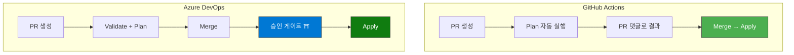

# 🏢 Azure DevOps Pipelines로 Terraform 자동 배포하기

> 고등학생도 따라할 수 있는 Step-by-Step 가이드  
> 대상 코드: `infra_terraform_v02` → 대상 리소스 그룹: `2dt-final-team4`

---

## 전체 흐름 한눈에 보기


> 요약: **코드 수정 → Azure Repos에 올림 → 파이프라인이 검사 → 관리자가 승인 → 자동 배포!**

---

## GitHub Actions vs Azure DevOps — 핵심 차이

| 항목 | GitHub Actions | Azure DevOps |
|:---|:---|:---|
| 코드 저장소 | GitHub | Azure Repos (또는 GitHub 연동) |
| 자동화 파일 | `.github/workflows/terraform.yml` | `azure-pipelines.yml` |
| 비밀번호 관리 | GitHub Secrets | Pipeline Variables (또는 Variable Groups) |
| Azure 연결 | Service Principal + 환경변수 | **Service Connection** (GUI로 클릭 설정) |
| 승인 방식 | PR 리뷰 + Merge | **Environment 승인 게이트** (결재판 느낌) |
| 장점 | 빠르고 직관적 | 엔터프라이즈급 권한 통제 |

---

## Step 1: Azure DevOps 프로젝트 만들기

### 1-1. [dev.azure.com](https://dev.azure.com) 접속 → 로그인

### 1-2. 새 프로젝트 생성

| 항목 | 입력값 |
|:---|:---|
| Project name | `NSC-Infrastructure` |
| Visibility | Private |
| Version control | Git |

> [!TIP]
> Azure DevOps는 무료로 5명까지 사용할 수 있습니다. 팀 프로젝트에 딱 좋습니다!

---

## Step 2: Azure에 "로봇 전용 출입증" 연결하기 (Service Connection)

GitHub Actions에서는 터미널에서 직접 Service Principal을 만들고 JSON을 복붙했지만, Azure DevOps에서는 **GUI(마우스 클릭)으로 훨씬 쉽게** 연결합니다.

### 2-1. 터미널에서 Service Principal 만들기

```bash
az ad sp create-for-rbac --name "azdo-terraform-deployer" --role Contributor --scopes /subscriptions/27db5ec6-d206-4028-b5e1-6004dca5eeef/resourceGroups/2dt-final-team4
```

출력된 `appId`, `password`, `tenant` 값을 메모합니다.

### 2-2. Azure DevOps에서 Service Connection 등록

1. **Project Settings** (좌측 하단 톱니바퀴) → **Service connections**
2. **New service connection** → **Azure Resource Manager** 선택
3. **Service principal (manual)** 선택
4. 아래 정보를 입력:

| 항목 | 입력값 |
|:---|:---|
| Subscription Id | `27db5ec6-d206-4028-b5e1-6004dca5eeef` |
| Subscription Name | `대한상공회의소 Data School` |
| Service Principal Id | Step 2-1에서 나온 `appId` |
| Service principal key | Step 2-1에서 나온 `password` |
| Tenant ID | Step 2-1에서 나온 `tenant` |
| Service connection name | `azure-terraform-connection` |

5. **Verify and save** 클릭 → 초록색 체크 ✅ 확인!

> [!IMPORTANT]
> 이 Service Connection 이름(`azure-terraform-connection`)을 파이프라인 YAML에서 그대로 사용합니다. 오타 주의!

---

## Step 3: 비밀 변수 등록하기 (Variable Groups)

### 3-1. Pipelines → Library → + Variable group

| Variable group name | `terraform-secrets` |
|:---|:---|

### 3-2. 변수 추가

| 변수 이름 | 값 | 🔒 자물쇠 |
|:---|:---|:---|
| `PG_ADMIN_PASSWORD` | PostgreSQL 관리자 비밀번호 | ✅ 클릭 (비밀로 보호) |

> 자물쇠(🔒) 아이콘을 클릭하면 값이 `********`로 가려져서 아무도 볼 수 없습니다.

---

## Step 4: 승인 환경 만들기 (Environments)

배포 전에 "정말 배포할래?" 하고 관리자 승인을 받는 **결재 게이트**를 만듭니다.

### 4-1. Pipelines → Environments → New environment

| 항목 | 입력값 |
|:---|:---|
| Name | `production` |
| Resource | None |

### 4-2. 승인자 설정

1. 생성된 `production` environment 클릭
2. 우측 상단 `⋮` → **Approvals and checks** → **Approvals**
3. 승인자(Approvers)에 본인 또는 팀 리더 추가
4. **Create** 클릭

> 이제 배포(`terraform apply`) 전에 반드시 지정된 사람이 "✅ 승인" 버튼을 눌러야만 실행됩니다!

---

## Step 5: Pipeline YAML 파일 만들기

프로젝트 루트에 아래 파일을 생성합니다:

```
infra_terraform_v02/azure-pipelines.yml
```

### 파일 내용

```yaml
# ═══════════════════════════════════════════════════════
# 🏢 Azure DevOps Pipeline — Terraform 자동 배포
# ═══════════════════════════════════════════════════════

trigger:
  branches:
    include:
      - main                    # main 브랜치에 push하면 자동 실행

pr:
  branches:
    include:
      - main                    # main으로의 PR이 올라오면 자동 실행

pool:
  vmImage: "ubuntu-latest"      # Microsoft가 제공하는 무료 리눅스 서버

variables:
  - group: terraform-secrets    # Step 3에서 만든 Variable Group 연결

stages:
  # ─── Stage 1: 검증 (PR + Push 모두 실행) ───
  - stage: Validate
    displayName: "🔍 코드 검증"
    jobs:
      - job: TerraformValidate
        displayName: "Terraform 검증"
        steps:
          # 1️⃣ Terraform 설치
          - task: TerraformInstaller@1
            displayName: "🔧 Terraform 설치"
            inputs:
              terraformVersion: "1.7.0"

          # 2️⃣ 초기화
          - task: TerraformTaskV4@4
            displayName: "📦 Terraform Init"
            inputs:
              provider: "azurerm"
              command: "init"
              backendServiceArm: "azure-terraform-connection"
              workingDirectory: "$(System.DefaultWorkingDirectory)"

          # 3️⃣ 문법 검사
          - script: terraform fmt -check
            displayName: "🔍 코드 포맷 검사"
            workingDirectory: "$(System.DefaultWorkingDirectory)"

          # 4️⃣ 유효성 검사
          - script: terraform validate
            displayName: "✅ 코드 유효성 검사"
            workingDirectory: "$(System.DefaultWorkingDirectory)"

  # ─── Stage 2: Plan (미리보기) ───
  - stage: Plan
    displayName: "📋 배포 미리보기"
    dependsOn: Validate
    jobs:
      - job: TerraformPlan
        displayName: "Terraform Plan"
        steps:
          - task: TerraformInstaller@1
            inputs:
              terraformVersion: "1.7.0"

          - task: TerraformTaskV4@4
            displayName: "📦 Terraform Init"
            inputs:
              provider: "azurerm"
              command: "init"
              backendServiceArm: "azure-terraform-connection"

          - task: TerraformTaskV4@4
            displayName: "📋 Terraform Plan"
            inputs:
              provider: "azurerm"
              command: "plan"
              commandOptions: "-parallelism=30"
              environmentServiceNameAzureRM: "azure-terraform-connection"
            env:
              TF_VAR_pg_admin_password: $(PG_ADMIN_PASSWORD)

  # ─── Stage 3: 배포 (승인 후 실행!) ───
  - stage: Deploy
    displayName: "🚀 Azure에 배포"
    dependsOn: Plan
    condition: and(succeeded(), eq(variables['Build.SourceBranch'], 'refs/heads/main'))
    jobs:
      - deployment: TerraformApply
        displayName: "Terraform Apply"
        environment: "production"           # ← Step 4에서 만든 승인 환경!
        strategy:
          runOnce:
            deploy:
              steps:
                - checkout: self

                - task: TerraformInstaller@1
                  inputs:
                    terraformVersion: "1.7.0"

                - task: TerraformTaskV4@4
                  displayName: "📦 Terraform Init"
                  inputs:
                    provider: "azurerm"
                    command: "init"
                    backendServiceArm: "azure-terraform-connection"

                - task: TerraformTaskV4@4
                  displayName: "🚀 Terraform Apply"
                  inputs:
                    provider: "azurerm"
                    command: "apply"
                    commandOptions: "-auto-approve -parallelism=30"
                    environmentServiceNameAzureRM: "azure-terraform-connection"
                  env:
                    TF_VAR_pg_admin_password: $(PG_ADMIN_PASSWORD)
```

---

## Step 6: 실제 사용 방법 (데일리 워크플로우)

### 시나리오: "서브넷을 하나 추가하자"

```bash
# 1. 새 브랜치 만들기
git checkout -b feature/add-new-subnet

# 2. 코드 수정 (예: modules/network/main.tf 편집)

# 3. 수정한 코드 올리기
git add .
git commit -m "feat: 신규 서브넷 추가"
git push origin feature/add-new-subnet

# 4. Azure DevOps 웹에서 PR(Pull Request) 생성
#    → 파이프라인이 자동으로 Validate + Plan 실행
#    → "검증 통과 ✅" or "검증 실패 ❌" 표시

# 5. 팀원이 리뷰하고 Approve → Complete (Merge)

# 6. Deploy 스테이지 실행 전 승인 요청 알림 발생
#    → 관리자가 Azure DevOps에서 "✅ Approve" 클릭
#    → terraform apply 자동 실행
#    → Azure에 서브넷이 실제로 추가됨! 🎉
```

---

## GitHub Actions vs Azure DevOps 파이프라인 비교



| 비교 | GitHub Actions | Azure DevOps |
|:---|:---|:---|
| 승인 방식 | PR 리뷰 (코드 레벨) | Environment 승인 게이트 (배포 레벨) |
| 보안 수준 | ⭐⭐⭐ | ⭐⭐⭐⭐⭐ |
| 설정 난이도 | 쉬움 (6분) | 보통 (15분) |
| 대기업 적합도 | 좋음 | **최고** |

---

## 한눈에 정리

| 단계 | 뭘 하나? | 어디서? | 몇 분? |
|:---|:---|:---|:---|
| Step 1 | DevOps 프로젝트 만들기 | dev.azure.com | 2분 |
| Step 2 | 로봇 출입증 연결 | DevOps Settings | 3분 |
| Step 3 | 비밀 변수 등록 | DevOps Library | 2분 |
| Step 4 | 승인 환경 만들기 | DevOps Environments | 2분 |
| Step 5 | 파이프라인 YAML 작성 | VS Code | 3분 |
| Step 6 | 코드 수정 → PR → 승인 → 배포 | DevOps 웹 + VS Code | 매일 반복 |

> [!TIP]
> GitHub Actions와 마찬가지로, 한 번 Step 1~5를 세팅해두면 그 다음부터는 **Step 6만 반복**하면 됩니다!
