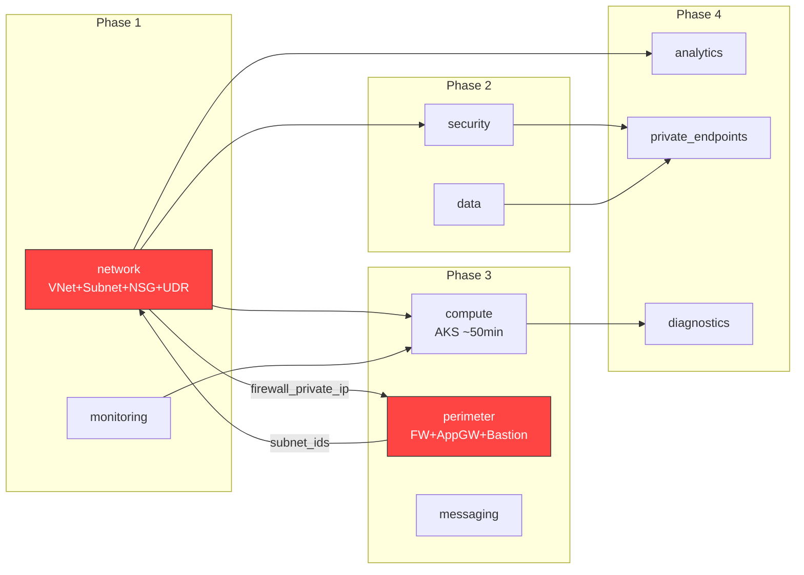
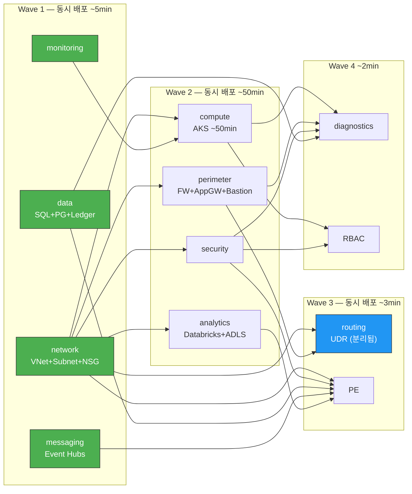

# Deploy TEST LOG — 배포 테스트 수정 기록

> **Date**: 2026-02-15  
> **Environment**: dev  
> **Subscription**: 대한상공회의소 Data School (`27db5ec6-d206-4028-b5e1-6004dca5eeef`)  
> **Resource Group**: `2dt-final-team4` (교육 환경 기존 RG)

---

## 수정 사항 총 8건 — 전부 코드/환경 설계 결함

> `terraform plan`은 통과하지만 실제 `terraform apply` 시 Azure API가 거부하는 코드 버그.
> 원본 코드에 영구 반영 필요. 원복 금지.

### 1. Resource Group — 구독 권한 제약

| 파일 | 원본 | 수정 | 사유 |
|:-----|:-----|:-----|:-----|
| `main.tf`, `outputs.tf` | `resource "azurerm_resource_group"` (`nsc-rg-dev`) | `data "azurerm_resource_group"` (`2dt-final-team4`) | 구독에서 RG 생성 권한 없음 (403) |

> 교육 환경뿐 아니라 실무에서도 권한 분리된 구독은 기존 RG 참조가 필요. `resource` → `data` 혹은 `variable`로 RG명 주입하는 구조로 변경 권장.

### 2. Messaging Subnet CIDR 충돌

| 파일 | 원본 | 수정 | 사유 |
|:-----|:-----|:-----|:-----|
| `variables.tf`, `terraform.tfvars` | `10.0.3.0/24` | `10.0.9.0/24` | `app`이 `/23`(10.0.2.0~10.0.3.255)이라 CIDR 범위 겹침 |

> CIDR 설계 시 `/23` 서브넷의 범위를 간과한 오류.

### 3. Confidential Ledger — Korea Central 미지원

| 파일 | 원본 | 수정 | 사유 |
|:-----|:-----|:-----|:-----|
| `modules/data/main.tf` | `var.location` (koreacentral) | `"southeastasia"` | Korea Central에서 Confidential Ledger 사용 불가 |

> 지원 리전: eastus, southcentralus, westus, westeurope, southeastasia 등.

### 4. ADLS Private Endpoint — Delegated 서브넷 오류

| 파일 | 원본 | 수정 | 사유 |
|:-----|:-----|:-----|:-----|
| `modules/private_endpoints/main.tf` | `subnet_ids["analytics_host"]` | `subnet_ids["data"]` | Databricks delegation 서브넷에 PE 생성 불가 |

### 5. AKS API Server VNet Integration 설정 오류

| 파일 | 원본 | 수정 | 사유 |
|:-----|:-----|:-----|:-----|
| `modules/compute/main.tf` | `api_server_access_profile { vnet_integration_enabled = true }` | 주석 처리 | 별도 API 서버 전용 서브넷(/28) + User Assigned MI 필요 |

> `private_cluster_enabled = true`로 보안 수준 동일. azurerm v4.0에서 deprecated 예정.

### 6. Application Gateway — TLS 1.0 Deprecated

| 파일 | 원본 | 수정 | 사유 |
|:-----|:-----|:-----|:-----|
| `modules/perimeter/main.tf` | `ssl_policy` 블록 없음 | `AppGwSslPolicy20220101` (TLS 1.2) 추가 | 기본값 TLS 1.0을 Azure가 거부 |

### 7. PostgreSQL — Zone 변경 불가

| 파일 | 원본 | 수정 | 사유 |
|:-----|:-----|:-----|:-----|
| `modules/data/main.tf` | `lifecycle` 없음 | `ignore_changes = [zone, ...]` 추가 | 이미 생성된 서버의 zone은 in-place 변경 불가 |

### 8. Ledger Private Endpoint — 구독 Feature 미등록

| 파일 | 원본 | 수정 | 사유 |
|:-----|:-----|:-----|:-----|
| `modules/private_endpoints/main.tf` | PE 리소스 활성 | 주석 처리 | `AllowPrivateEndpoints` feature 구독 미등록 |
| `modules/private_endpoints/outputs.tf` | `ledger = ...` | 주석 처리 | 위와 동일 |

> 실제 환경: `az feature register --name AllowPrivateEndpoints --namespace Microsoft.Network` 실행 후 활성화 가능.

---

### 9. AKS Kubernetes Version — 리전 호환성

| 파일 | 원본 | 수정 | 사유 |
|:-----|:-----|:-----|:-----|
| `modules/compute/main.tf` | `1.28` | `1.32` | Standard tier에서 koreacentral 리전 사용 가능한 최신 버전 |

> `1.28` → `1.30` → `1.31` → `1.32` 순으로 시도. `az aks get-versions`로 확인.

---

## 배포 상태

- [x] 1차 `terraform apply` — 부분 성공 (#2, #3, #4, #5 실패)
- [x] 2차 `terraform apply` — 부분 성공 (#4, #5 실패)
- [x] 3차 `terraform apply` — 부분 성공 (#5, #6, #7, #8 실패)
- [x] 4차 `terraform apply` — AKS 생성 시작 (~50분 후 중단), import로 state 동기화
- [x] 5차 `terraform apply` — AKS modify 30분 타임아웃 (autoscaler 설정 동기화)
- [x] `terraform destroy` 완료 — **96 resources destroyed**
  - `DO_NOT_DELETE` resource lock 제거 후 실행
- [x] 6차 `terraform apply -parallelism=30` — **✅ 성공, 112 resources created**
  - 순환 의존성 해소 (`routing` 모듈 분리) + `local_account_disabled = false`
  - `terraform apply "tfplan_parallel"` 실행 (~13min, AKS 병목)
  - 11개 모듈 전부 정상 배포

---

## AKS 배포 실패 원인 분석

| 단계 | 원인 | 영향 |
|:-----|:-----|:-----|
| 1~3차 apply | `vnet_integration_enabled = true` (전용 서브넷/MI 미구성) | AKS 생성 자체 실패 |
| 1~3차 apply | `kubernetes_version` 비호환 (`1.28` → `1.32` 까지 시도) | 리전 지원 버전 불일치 |
| 4차 apply | AKS 생성 ~50분 소요 → Ctrl+C 중단 | State 불일치 (import로 복구) |
| 5차 apply | `local_account_disabled = true` → credential fetch 차단 | AKS modify 30분+ 무응답, `Get Managed Cluster` 253회 polling |

> **근본 원인:** `local_account_disabled = true` 설정으로 Azure API가 클러스터 상태 조회 시 credential을 가져오지 못해 modify 작업이 무한 대기 상태에 빠짐.

---

## 다음 배포 계획 — 병렬 배포 전략

### 변경 사항 요약 (3건)

| # | 파일 | 변경 | 사유 |
|:--|:-----|:-----|:-----|
| 10 | `modules/compute/main.tf` | `local_account_disabled = false` | #9 근본 원인 해소 (credential fetch 차단 → modify 무한 대기) |
| 11 | `modules/network/main.tf` | UDR 리소스 10개 **삭제** | `routing` 모듈로 이동 (순환 의존성 해소) |
| 12 | `modules/routing/` [NEW] | UDR 독립 모듈 생성 | `network` ↔ `perimeter` 순환 참조 제거 |

### 순환 의존성 해소 — `routing` 모듈 분리

**문제:** `network` → `perimeter.firewall_private_ip` (UDR next hop) + `perimeter` → `network.subnet_ids` = **순환 참조**
**해결:** UDR을 `routing` 모듈로 분리 → `network`와 `perimeter` 동시 배포 가능

#### Before — 순환 의존성 (직렬 배포)



> ⛔ `network` ↔ `perimeter` 순환 참조로 **전체 파이프라인 직렬화**

#### After — 순환 의존성 해소 (병렬 배포)



> ✅ `routing` 모듈 분리로 Wave 1에서 4개 모듈 동시 배포, Wave 2에서 4개 모듈 동시 배포

### 병렬 배포 Wave 구조

```
Wave 1 (동시): network, monitoring, data, messaging     ← ~5min
Wave 2 (동시): security, compute, perimeter, analytics   ← ~50min (AKS 병목)
Wave 3 (동시): routing, private_endpoints                ← ~3min
Wave 4 (동시): diagnostics, RBAC                         ← ~2min
                                                  합계: ~60min
```

### 배포 명령어

```powershell
terraform apply -parallelism=30
```

> `-parallelism=30`: 기본값 10 → 30으로 증가. Azure API Rate Limit 범위 내 최적값.
> Wave 1에서 `data`(SQL+PG+Ledger)와 `messaging`(Event Hubs)이 `network`과 동시 배포됨.

### 배포 후 보안 강화

```diff
# 클러스터 안정화 확인 후
- local_account_disabled  = false
+ local_account_disabled  = true    # CKV_AZURE_115 복원
```

