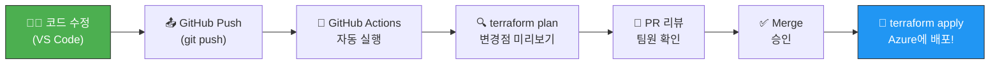

# 🚀 GitHub Actions CI/CD로 Terraform 자동 배포하기

> 고등학생도 따라할 수 있는 Step-by-Step 가이드  
> 대상 코드: `infra_terraform_v02` → 대상 리소스 그룹: `2dt-final-team4`

---

## 전체 흐름 한눈에 보기



> 요약: **코드 수정 → GitHub에 올림 → 로봇이 검사 → 팀원이 확인 → 합치면 자동 배포!**

---

## Step 1: Azure에 "로봇 전용 출입증" 만들기

GitHub Actions 로봇이 Azure 클라우드에 로그인하려면, 사람처럼 아이디/비밀번호로 로그인할 수 없으므로 **Service Principal**이라는 "로봇 전용 출입증"을 만들어야 합니다.

### 터미널에서 실행

```bash
az ad sp create-for-rbac \
  --name "github-terraform-deployer" \
  --role Contributor \
  --scopes /subscriptions/27db5ec6-d206-4028-b5e1-6004dca5eeef/resourceGroups/2dt-final-team4 \
  --sdk-auth
```

### 출력 결과 (⚠️ 절대 외부에 공유 금지!)

```json
{
  "clientId": "xxxxxxxx-xxxx-xxxx-xxxx-xxxxxxxxxxxx",
  "clientSecret": "xxxxxxxxxxxxxxxxxxxxxxxxxxxxxxxxxx",
  "subscriptionId": "27db5ec6-d206-4028-b5e1-6004dca5eeef",
  "tenantId": "xxxxxxxx-xxxx-xxxx-xxxx-xxxxxxxxxxxx",
  ...
}
```

> 이 JSON 출력물 전체를 **복사해서 메모장에 잠시 저장**해 두세요. 바로 다음 단계에서 씁니다.

---

## Step 2: GitHub에 "금고(Secrets)" 등록하기

로봇의 출입증(비밀번호)을 GitHub의 금고에 넣어두면, 아무도 볼 수 없고 로봇만 꺼내 씁니다.

### 2-1. GitHub 레포지토리 → Settings → Secrets and variables → Actions

아래 **5개의 Secret**을 등록합니다:

| Secret 이름 | 값 (Step 1에서 복사한 것) |
|:---|:---|
| `AZURE_CLIENT_ID` | `clientId` 값 |
| `AZURE_CLIENT_SECRET` | `clientSecret` 값 |
| `AZURE_SUBSCRIPTION_ID` | `27db5ec6-d206-4028-b5e1-6004dca5eeef` |
| `AZURE_TENANT_ID` | `tenantId` 값 |
| `PG_ADMIN_PASSWORD` | PostgreSQL 관리자 비밀번호 |

> [!IMPORTANT]
> `PG_ADMIN_PASSWORD`는 현재 `secrets.auto.tfvars`에 들어있는 PostgreSQL 비밀번호입니다. CI/CD 환경에서는 이 파일이 없으므로 반드시 여기에 등록해야 합니다.

---

## Step 3: Workflow 파일 만들기

프로젝트 루트에 아래 경로로 파일을 생성합니다:

```
infra_terraform_v02/.github/workflows/terraform.yml
```

### 파일 내용

```yaml
name: "🚀 Terraform Deploy"

# ─── 언제 실행되나? ───
on:
  # main 브랜치에 PR을 올리면 → plan (미리보기만)
  pull_request:
    branches: [main]
  # main 브랜치에 merge(합치기)하면 → apply (실제 배포)
  push:
    branches: [main]

# ─── 권한 설정 ───
permissions:
  contents: read
  pull-requests: write    # PR에 plan 결과를 댓글로 달기 위해

# ─── 환경 변수 ───
env:
  TF_VAR_pg_admin_password: ${{ secrets.PG_ADMIN_PASSWORD }}
  ARM_CLIENT_ID:            ${{ secrets.AZURE_CLIENT_ID }}
  ARM_CLIENT_SECRET:        ${{ secrets.AZURE_CLIENT_SECRET }}
  ARM_SUBSCRIPTION_ID:      ${{ secrets.AZURE_SUBSCRIPTION_ID }}
  ARM_TENANT_ID:            ${{ secrets.AZURE_TENANT_ID }}

jobs:
  terraform:
    name: "Terraform"
    runs-on: ubuntu-latest          # GitHub이 제공하는 무료 리눅스 서버

    steps:
      # 1️⃣ 코드 가져오기
      - name: 📥 코드 체크아웃
        uses: actions/checkout@v4

      # 2️⃣ Terraform 설치
      - name: 🔧 Terraform 설치
        uses: hashicorp/setup-terraform@v3
        with:
          terraform_version: "1.7.0"

      # 3️⃣ 초기화 (terraform init)
      - name: 📦 Terraform Init
        run: terraform init

      # 4️⃣ 문법 검사 (terraform fmt)
      - name: 🔍 코드 포맷 검사
        run: terraform fmt -check

      # 5️⃣ 유효성 검사 (terraform validate)
      - name: ✅ 코드 유효성 검사
        run: terraform validate

      # 6️⃣ 미리보기 (terraform plan)
      - name: 📋 배포 미리보기 (Plan)
        id: plan
        run: terraform plan -no-color -parallelism=30
        continue-on-error: true

      # 7️⃣ PR에 plan 결과 댓글 달기 (PR일 때만)
      - name: 💬 PR에 Plan 결과 댓글
        if: github.event_name == 'pull_request'
        uses: actions/github-script@v7
        with:
          script: |
            const output = `### 🚀 Terraform Plan 결과

            \`\`\`
            ${{ steps.plan.outputs.stdout }}
            \`\`\`

            > 📌 Merge하면 위 변경사항이 Azure에 자동 배포됩니다!`;

            github.rest.issues.createComment({
              issue_number: context.issue.number,
              owner: context.repo.owner,
              repo: context.repo.repo,
              body: output
            });

      # 8️⃣ 실제 배포 (main에 push/merge 될 때만!)
      - name: 🚀 Azure에 배포! (Apply)
        if: github.ref == 'refs/heads/main' && github.event_name == 'push'
        run: terraform apply -auto-approve -parallelism=30
```

---

## Step 4: 실제 사용 방법 (데일리 워크플로우)

### 시나리오: "방화벽 규칙을 하나 추가하자"

```bash
# 1. 새 브랜치 만들기
git checkout -b feature/add-firewall-rule

# 2. 코드 수정 (예: modules/perimeter/main.tf 편집)

# 3. 수정한 코드 올리기
git add .
git commit -m "feat: 방화벽 아웃바운드 규칙 추가"
git push origin feature/add-firewall-rule

# 4. GitHub 웹에서 PR(Pull Request) 생성
#    → 로봇이 자동으로 terraform plan을 돌리고
#    → PR 댓글에 "리소스 1개 추가될 예정입니다!" 라고 알려줌

# 5. 팀원이 리뷰하고 "LGTM 👍" 승인

# 6. Merge 버튼 클릭
#    → 로봇이 terraform apply를 자동 실행
#    → Azure에 방화벽 규칙이 실제로 추가됨! 🎉
```

---

## 한눈에 정리

| 단계 | 뭘 하나? | 어디서? | 몇 분? |
|:---|:---|:---|:---|
| Step 1 | 로봇 출입증 만들기 | 터미널 (az 명령어) | 1분 |
| Step 2 | 금고에 비밀번호 등록 | GitHub 웹 (Settings) | 2분 |
| Step 3 | 자동화 레시피 파일 작성 | VS Code (yml 파일) | 3분 |
| Step 4 | 코드 수정 → PR → Merge | GitHub 웹 + VS Code | 매일 반복 |

> [!TIP]
> 한 번 Step 1~3을 세팅해두면, 그 다음부터는 **Step 4만 반복**하면 됩니다. 코드를 고치고 올리기만 하면 로봇이 알아서 Azure에 배포해줍니다!
